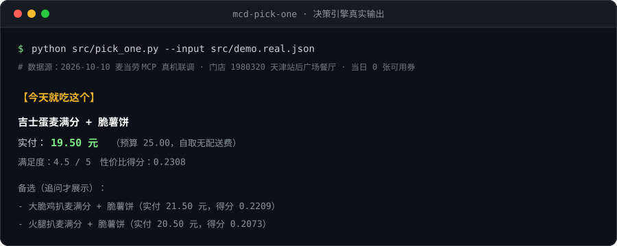

<div align="center">

# 🍔 mcd-pick-one

**懒得想吃什么？我只给你一个答案。**

给「预算卡死 + 选择恐惧」的大学生用的麦当劳点单助手。
不列候选、不给选项，每次只推 **1 个**方案。

[](https://mcp.mcd.cn)
[](https://www.workbuddy.cn)
[](#依赖)
[](#依赖)
[](#真机联调已验证)
[](https://github.com/zhouzhou20200/mcd-pick-one/stargazers)



<sub>↑ 上图是 <code>src/pick_one.py</code> 跑<strong>真机联调真实数据</strong>（2026-10-10 麦当劳 MCP 实调）的输出，不是设计稿。</sub>

</div>

---

## 真机联调已验证

2026-10-10，**2 个批次 / 21 次调用 / 11 个不同 Tool** 全部为真实调用（只读，无模拟数据）。设计使用的 12 个 Tool 中已验证 10 个，未验证的 2 个是外送场景工具。

| 项目 | 真实返回 |
|:--|:--|
| 附近门店 | 天津站周边 **5 家**，最近 323 m（`1980320` 天津站后广场餐厅） |
| 该门店可用券 | **0 张** —— `query-store-coupons` 返回空数组，券包也为空 |
| 可领券 | 麦麦省 **8 条**（含「免费脆薯饼」） |
| 官方核价 | 吉士蛋麦满分 + 脆薯饼 = **19.50 元**（`calculate-price` 实测，`discount=0`） |
| 当月活动 | **18 条**，其中 **5 条**标注为当日 |
| 营养数据 | **160 条**（能量 / 蛋白质 / 脂肪 / 碳水 / 钠 / 钙） |
| 会员积分 | 可用 86.8 |

完整入参、原始 JSON 与 `traceId` 全部留档 → [`docs/real-call-log.md`](./docs/real-call-log.md)

> **联调最有价值的部分，是它推翻了我们自己的五条假设：**
> ① 麦当劳菜单**按时段切换**——上午 10 点取到的是早餐菜单，里面**根本没有麦辣鸡腿堡，也没有巨无霸**；
> ② 但**「档期」不能当作菜单的判据**——10:28 门店档期已切到午市，`query-meals` 却仍返回早餐菜单；档期是"可预约时段"，与实际可售存在**不同步窗口**；
> ③ 该门店当日**一张可用券都没有**——"省钱"不能全押在券上，必须有降级路径；
> ④ **「优惠」不止券**——还有随单购卡（麦咖啡 25 元 → 9.9 元）和活动价；
> ⑤ **未领取的券无法代入核价**——所以券必须前置处理，不能当答案末尾的提示。

---

## 它跟"省钱助手"不是一回事

麦当劳 MCP 赛道里已经有十几个"省钱助手"了。它们优化的是**价格**，这个项目优化的是**决策**。

| | 常见的省钱助手 | **mcd-pick-one** |
|:--|:--|:--|
| 输出 | 一列候选，让你接着挑 | **1 个答案**；追问才给备选，总数 ≤ 3 |
| 预算 | "尽量便宜" / 只报参考价 | **硬上限 25 元**，压不进去就如实说超了多少 |
| 价格口径 | 菜单价 | **券代入官方 `calculate-price` 核出的实付价** |
| 吃饱 | 一般不检查 | 强制「主食 + 配餐」结构 |
| 无解时 | 硬凑一个给你 | 如实告知「最接近的 X 元，超了 Y 元」 |
| 口味 | 无记忆 | 口味档案，按 `满足度 ÷ 实付价` 排序 |

> **一句话：便宜是门槛，治选择恐惧才是卖点。**

---

## 它解决什么

| 你的状态 | mcd-pick-one 的回应 |
|:--|:--|
| 懒得看菜单、比价、算券 | 全替你算完，只说结论 |
| 选项一多就卡住 | **只给 1 个答案**，不给你挑 |
| 一餐预算 25 元，超了难受 | **硬预算**，自动用券把价格压回来 |
| 便宜怕吃不饱 | 强制「主食 + 配餐」结构，不会给你一个孤零零的汉堡 |
| 有忌口、口味挑 | 记住你吃过什么、不吃什么 |
| 上课累，有时不想出门 | 每次问一句：自己拿还是送 |
| 怕错过活动/券，又不想被信息轰炸 | **最多提示 1 句**，且只提示"错过就没了"的；没有就**不说** |

---

## 目录

- [真机联调已验证](#真机联调已验证)
- [快速开始](#快速开始)
- [使用示例](#使用示例)
- [核心逻辑](#核心逻辑)
- [为什么价格是"算"出来的](#为什么价格是算出来的)
- [券必须"先领再算"](#券必须先领再算)
- [顺手提示：最多一句，没有就沉默](#顺手提示最多一句没有就沉默)
- [本地试跑决策引擎](#本地试跑决策引擎)
- [项目结构](#项目结构)
- [目标用户](#目标用户)
- [设计边界（明确不做）](#设计边界明确不做)
- [依赖](#依赖)
- [声明](#声明)

---

## 快速开始

### 1. 拿到麦当劳 MCP Token

到 [麦当劳 MCP Server](https://github.com/M-China/mcd-mcp-server) 用手机号登录 → 控制台 → 激活 → 复制 Token。

### 2. 在 WorkBuddy 里配置连接器

左侧边栏【专家·技能·连接器】→【连接器】→ 右上角【自定义连接器】→【配置 MCP】，填入（把 `<你的Token>` 换掉）：

```json
{
  "mcpServers": {
    "mcd-mcp": {
      "type": "streamablehttp",
      "url": "https://mcp.mcd.cn",
      "headers": {
        "Authorization": "Bearer <你的Token>"
      }
    }
  }
}
```

> 脱敏示例见 [`mcp-config.example.json`](./mcp-config.example.json)，里面**只有环境变量占位符**，不含任何真实凭证。
> ⚠️ 配置保存后，请在【自定义连接器】页面把 `mcd-mcp` **启用**，配置才会生效。

### 3. 开始用

直接在对话框里说：

```
中午吃啥，帮我定一个
```

它会问你一句（取餐方式 / 忌口 / 要不要饮料，**回车就用默认值**），然后给你**唯一一个答案**。

---

## 使用示例

下面这段是 **2026-10-10 真机联调时的真实输入与输出**（原始数据见 [`docs/real-call-log.md`](./docs/real-call-log.md)）。

```
你：中午吃啥，帮我定一个

AI：问三件事（都可以直接回车走默认）
    ① 自己拿还是送？   → 默认：自己拿
    ② 今天有忌口吗？   → 默认：用档案
    ③ 配个饮料吗？     → 默认：不要

你：（回车）

AI：【今天就吃这个】
    吉士蛋麦满分 + 脆薯饼
    用券：本店当前无可用券（已核实 query-store-coupons 为空）
    实付：19.50 元（官方 calculate-price 核价）
    取餐：天津站后广场餐厅 · 到店自取
    结构达标：主食 + 配餐，能吃饱
```

> 注意这里**没有"省了多少钱"**——因为该门店当天真的一张券都没有。
> 项目不会为了好看编一个不存在的优惠。

换成外送（+9 元配送费），预算就守不住了——**不硬凑，直接说实话**：

```
AI：【今天没有完全符合的】
    最接近的是 吉士蛋麦满分 + 脆薯饼，实付 28.50 元，超了 3.50 元。
    改到店自取可省 9 元，落回 19.50 元。
    要不要改自取？还是放宽预算？
```

**顺带一句（最多 1 句）**

档期要切换时会追加一行——这是当天**唯一"错过就没了"**的信息：

```
⏰ 天津站后广场餐厅的早餐档 10:15 结束（还有 3 分钟），现在下单还来得及。
```

而那 8 张"可以领"的券**不会出现在这里**——它们会改变最优答案，所以在出答案**之前**就处理掉了（见 [券必须"先领再算"](#券必须先领再算)）。
没有合格信息时，它**什么都不补**。

---

## 核心逻辑

```
⓪ 取时间          now-time-info → 服务器时间（档期锚点 / 「仅今日」活动判据）
① 定位门店        query-nearby-stores / delivery-query-stores
② 取券           query-store-coupons / query-my-coupons / available-coupons
②′ 优惠前置 ★     已有券逐张试算 → 有可领券先问用户 → 随单购卡/活动价一并计入
③ 取菜单          query-meals → query-meal-detail（rounds[].name 即官方主食/小食/饮料分类）
④ 硬筛选          剔除忌口 → 必须「主食+配餐」→ 实付 ≤ 25 元
⑤ 算价           calculate-price（有券走券；无券按菜单价精算，双路径）
⑥ 打分           score = 口味满足度 ÷ 实付价
⑦ 只吐一个        追问才给备选，总数 ≤ 3
⑧ 组装答案        点什么 / 用哪张券 / 实付多少 / 去哪拿
⑨ 顺手提示        三门槛过滤 → 最多 1 句；没有合格项就沉默
```

共调用 **12 个**麦当劳 MCP Tool（其中 **10 个已于 2026-10-10 完成真机调用验证**）。逐项说明、调用时序、以及**为什么没用另外 23 个 Tool**，见 [`MCP_INTEGRATION.md`](./MCP_INTEGRATION.md)。

---

## 为什么价格是"算"出来的

这是本项目最关键的一个设计决定，也是它敢承诺"硬预算"的唯一底气。

先说两组**真实数字**：

- **正餐时段**：麦辣鸡腿堡 23 元、巨无霸 25.5 元 —— 加一份配餐必然破 25 元，**几乎只能靠券**；
- **早餐时段**：真机联调实测，吉士蛋麦满分 10.5 元 + 脆薯饼 9 元 = **19.50 元** —— **不需要券也能达标**。

两条事实合起来说明：预算守不守得住，**既不只取决于券，也不只取决于菜单价**，还得看当前时段落在哪一档——而这三件事没有一件是"看菜单价"就能判断的。

所以本项目不靠"筛便宜的"，而是走**双路径核价**：

1. **有券** → 把门店可用券**逐张代入**官方 `calculate-price` 真的算一遍；
2. **无券** → 按菜单价精算「主食 + 配餐」组合（实测此时总价恰好等于菜单价之和）；
3. 无论走哪条路，**只认算出来的价**，菜单价不作为最终判断依据；
4. 两条路都撑不起预算，就**如实认输**（输出"最接近的 + 超出金额"），绝不虚假满足。

> 便宜不是筛出来的，是算出来的。

---

## 券必须"先领再算"

真机联调实测（2026-10-10）：券包是**空的**，但 `available-coupons` 里有 **8 条可领取**记录——其中包括**「免费脆薯饼」**。

**不是没券，是从来没领过。**

问题出在这：`calculate-price` 要试算优惠，需要 `couponId` / `couponCode`，而**未领取的券拿不到券码**。也就是说——

> 如果把这张券放到答案末尾当"顺手提示"，那**最省的那个答案已经先算错了**。
> 「免费脆薯饼」若生效，当天这单会从 19.50 元变成 **10.50 元**。

所以本项目把券当成**决策输入**，而不是展示信息。它在流程里的位置是「②′ 优惠前置」——**在下结论之前**：

```
发现可领券（尤其「免费 X」「买一送一」）
  → 问一句「有张券能省 X 元，要不要领？」
      同意 → auto-bind-coupons → 重新核价 → 再给答案
      拒绝 → 按无券路径算，且不再提这张券
```

顺带说——**"优惠"不止券一种**。实测同一天里三类并存：

| 类别 | 例子 | 数据来源 |
|------|------|----------|
| 券 | 免费脆薯饼 / 麦旋风买一送一 | `available-coupons` |
| **随单购卡** | 麦咖啡 25 元 → **9.9 元** | `query-meals` 的 `discountType` |
| **活动价** | 厚松饼堡早餐卡 6 折 | `campaign-calendar` |

「便宜是算出来的」这句话里的"券"，其实该写成"**优惠**"。

---

## 顺手提示：最多一句，没有就沉默

推荐类助手最常见的失败不是"说得太少"，而是**说得太多**。答案后面再堆一句"另外你还有 8 张券可以领、这个月有联名周边、积分商城 88 分能换……"，用户就又回到了"要做决定"的状态——而这正是本项目要消除的东西。

所以提示不是"有信息就说"，必须**同时**通过三道门槛：

| 门槛 | 判断标准 | 反例 |
|:--:|------|------|
| ① 现在就能做 | 不需要等、不需要额外条件 | "周一有 9.9 元早餐"——今天周六，不提示 |
| ② 错过不可逆 | 过了这个点当天就没了 | "有 8 张券可以领"——明天也能领，**不进提示** |
| ③ 只留 1 条 | 多条合格时取**最紧急**的 1 条 | 堆 3 条 = 又变成信息墙 |

**只有三类信息可能通过：**

| 类型 | 数据来源 |
|------|----------|
| ⏰ 档期即将切换 | `query-nearby-stores` 的 `reservationTimeOptions` + `now-time-info` |
| 🎰 仅今日有效的活动 | `campaign-calendar` 中标注"仅 X 月 X 日"的条目 |
| 🎫 手里已有且 ≤48 小时过期的券 | `query-my-coupons` 的 `tradeDateTime` |

**没有合格项时：一句都不说。** 保持沉默是设计的一部分，不是遗漏。

实现见 [`src/rank_tips.py`](./src/rank_tips.py)，用真实档期数据跑：

```bash
python src/rank_tips.py --input src/demo.tips.json --now "2026-10-10 10:12"
```

```
【顺手提示】
  ⏰ 天津站后广场餐厅的早餐档 10:15 结束（还有 3 分钟），现在下单还来得及。
  被门槛③丢弃（同类过多，只留最紧急的 1 条）：
    · 🎰 「参与麦金喜抽奖，得[积分霸王餐]」今天最后一天。
```

换一个没有合格信息的时刻——**它选择不说话**：

```bash
python src/rank_tips.py --input src/demo.tips.json --now "2026-10-11 15:30"
```

```
【顺手提示】
  （无）三道门槛均未通过 —— 本次保持沉默。
```

加 `--all` 可看完整判定链，包括哪些信息**连候选资格都没有**（那 4 条长期活动就被挡在这一层）。

---

## 本地试跑决策引擎

`src/pick_one.py` 是**纯标准库**脚本，不联网、零依赖，可直接验证决策逻辑。

### 用真机联调的真实数据跑

`src/demo.real.json` 是 2026-10-10 从麦当劳 MCP 实调下来的**真实菜单快照**（门店 `1980320`，早餐时段，当日 **0 张可用券**）：

```bash
python src/pick_one.py --input src/demo.real.json
```

```
【今天就吃这个】
  吉士蛋麦满分 + 脆薯饼
  实付：19.50 元（预算 25.00，自取无配送费）
  满足度：4.5 / 5　性价比得分：0.2308
  备选（追问才展示）：
    - 大脆鸡扒麦满分 + 脆薯饼（实付 21.50 元，得分 0.2209）
    - 火腿扒麦满分 + 脆薯饼（实付 20.50 元，得分 0.2073）
```

同一批真实数据换成外送（+9 元配送费），预算失守，触发兜底：

```bash
python src/pick_one.py --input src/demo.real.json --delivery-fee 9
```

```
【今天没有完全符合的】
最接近的是 吉士蛋麦满分 + 脆薯饼，实付 28.50 元，超了 3.50 元。
要不要就按这个来？还是放宽预算？
```

### 用通用示例数据跑

`src/demo.json` 是一份不依赖具体门店的通用示例（含正餐时段菜品）：

```bash
python src/pick_one.py --input src/demo.json --budget 25
```

```
【今天就吃这个】
  双层吉士汉堡套餐
  构成：双层吉士汉堡 + 中薯条
  实付：21.00 元（预算 25.00，自取无配送费）
  满足度：4.8 / 5　性价比得分：0.2262
  备选（追问才展示）：
    - 麦辣鸡腿堡套餐（实付 24.00 元，得分 0.1875）
```

加 `--json` 可输出原始结果，便于二次开发。

> 这个脚本的意义：**即使 MCP 服务不可用，决策逻辑本身依然可被独立验证**。

---

## 项目结构

```
mcd-pick-one/
├── README.md                    项目说明（本文件）
├── CONTEST_DECLARATION.md       参赛声明（官方原文，不可修改）
├── MCP_INTEGRATION.md           MCP 工具与调用流程说明
├── mcp-config.example.json      脱敏配置示例（仅环境变量占位符）
├── workbuddy.md                 WorkBuddy 开发过程记录
├── docs/
│   └── real-call-log.md         真机联调记录（入参 / 原始返回 / traceId）
├── images/
│   └── demo.svg                 运行输出示意图
├── src/
│   ├── SKILL.md                 技能主逻辑（技能定义与执行指令）
│   ├── pick_one.py              决策引擎：选餐 + 打分 + 排序 + 兜底（可独立运行）
│   ├── rank_tips.py             顺手提示排序：三门槛过滤，最多 1 条，默认沉默（可独立运行）
│   ├── profile.example.json     口味档案模板
│   ├── demo.json                通用示例输入（选餐）
│   ├── demo.real.json           真机联调的真实菜单快照（选餐）
│   └── demo.tips.json           真机联调的真实档期/活动数据（提示排序）
└── 需求文档.md                   需求规格（开发内部文档）
```

---

## 目标用户

在校大学生。场景是上课间隙、宿舍、图书馆——**时间零碎、预算有限、不想做决定**。

---

## 设计边界（明确不做）

- ❌ **不真实下单**（`create-order` 会扣款，风险不可控，由用户手动操作）
- ❌ **不静默自动领券**（`auto-bind-coupons` 是写操作，必须经用户明确同意）
- ❌ **不碰抽奖 / 积分商城**（`draw-lottery` 会扣积分）
- ❌ **不做健身 / 营养管理**（该赛道已饱和）

---

## 依赖

| 依赖 | 说明 |
|:--|:--|
| 麦当劳 MCP Server | `https://mcp.mcd.cn`，需自备 Token |
| WorkBuddy | 推荐宿主环境（本项目的开发与运行环境） |
| Python 3.8+ | 仅 `src/pick_one.py` 需要，纯标准库，零第三方依赖 |

---

## 声明

本项目为**麦当劳程序员创意开发大赛参赛作品**，由参赛者独立开发，**非麦当劳官方产品**。
项目输出仅供参考，不构成医疗、营养或其他专业建议；餐品信息、价格及供应状态以麦当劳官方渠道的实时结果为准。

---

<div align="center">

**如果这个东西让你少纠结了一次午饭，点个 ⭐ 就是最好的反馈。**

</div>
